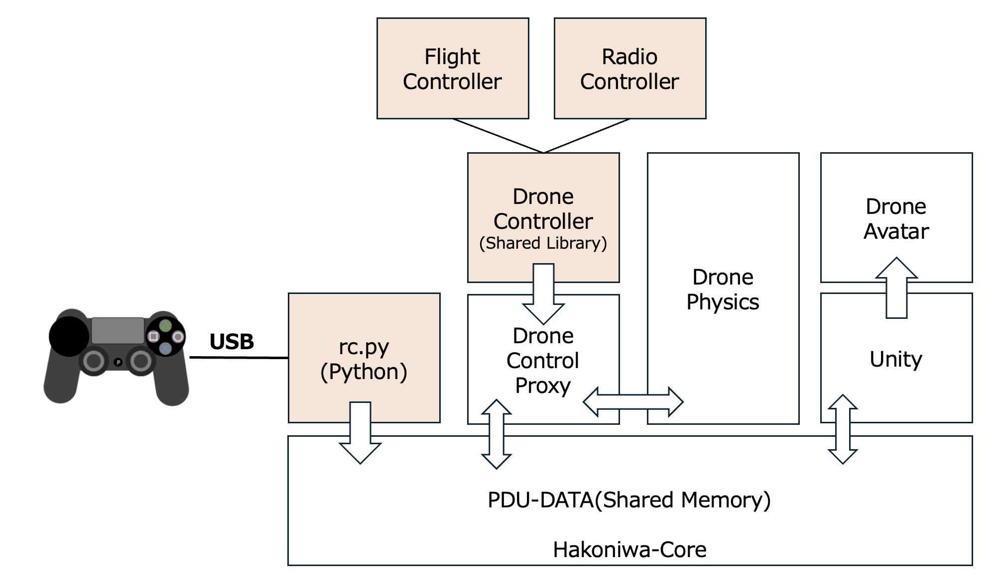

[English](README.md) ｜ 日本語

# はじめに
本マニュアルでは、PS4コントローラを使用してドローンを操作する方法を説明します。

# 設定

## 必要な機材

* PS4コントローラ
* USB接続ケーブル

## 必要なソフトウェア

* Python 3.12
* [箱庭ドローンシミュレータの想定環境](https://github.com/toppers/hakoniwa-px4sim/blob/main/README-ja.md#%E7%92%B0%E5%A2%83)

# アーキテクチャ

## 構成

箱庭ドローンシミュレータをPS4コントローラで操作する構成は下図の通りです。



USB接続されたPS4コントローラの操作内容は、Pythonプログラム [rc.py](https://github.com/toppers/hakoniwa-px4sim/blob/main/drone_api/sample/rc.py) で解析され、箱庭のPDUデータとして送信されます。

送信されたPDUデータは、ドローン制御プログラム(DroneControlProxy)が受信します。DroneControlProxyは、ユーザ定義のドローン制御モデルをローダブルモジュールとローディングし、制御データをバイパスします。ローディング対象のローダブルモジュールは、ドローンのパラメータ定義ファイルで指定します。PS4コントローラによる操作を実現する制御プログラムとしては、RadioControllerとFlightControllerがあります。

* [RadioController](https://github.com/toppers/hakoniwa-px4sim/tree/main/drone_control/workspace/RadioController)
  * ドローンを機体座標系の視点で操作する制御プログラムです(通常のドローンのラジコン操作感で制御されます)。
* [FlightController](https://github.com/toppers/hakoniwa-px4sim/tree/main/drone_control/workspace/FlightController)
  * ドローンを地上座標系の視点で操作する制御プログラムです。

制御データは、DronePhysicsに伝播し、その物理モデルに従ってドローンの位置や姿勢が変化します。Unityはそのデータを定期的に受信し、DroneAvatarとしてビジュアライズします。


## インストール手順

1. [箱庭ドローンシミュレータのインストール](https://github.com/toppers/hakoniwa-px4sim/blob/main/hakoniwa/README-ja.md)
2. [箱庭ドローン制御プログラムのビルド](https://github.com/toppers/hakoniwa-px4sim/blob/main/drone_control/README-ja.md#%E3%83%93%E3%83%AB%E3%83%89%E6%96%B9%E6%B3%95)
3. [箱庭ドローン Python ライブラリのインストール](https://github.com/toppers/hakoniwa-px4sim/blob/main/drone_api/README-ja.md#%E3%82%A4%E3%83%B3%E3%82%B9%E3%83%88%E3%83%BC%E3%83%AB%E6%96%B9%E6%B3%95)


# シミュレーション実行方法

端末を２個起動し、以下の順番でプログラムを起動します。

端末A:
```
cd hakoniwa
bash drone-app.bash <path/to>/hakoniwa-unity-drone-model ./config/api_sample
```

端末B:
```
cd drone_api/sample
python3.12 rc.py <path/to>/hakoniwa-unity-drone-model/custom.json
```

次に、Unityを起動し、STARTボタンをクリックするとシミュレーション開始します。

シミュレーションを止める場合は、起動順番と逆順でプログラムを停止してください。

# 基本操作

ドローン操作は、[モード２](https://atcl-dsj.com/useful/2264/#:~:text=%E3%83%BB%E3%83%A2%E3%83%BC%E3%83%89%EF%BC%92%E3%81%AE%E6%93%8D%E4%BD%9C%E6%96%B9%E6%B3%95&text=%E3%83%A2%E3%83%BC%E3%83%89%EF%BC%92%E3%81%AE%E6%93%8D%E4%BD%9C%E6%96%B9%E6%B3%95%E3%81%A8%E3%81%97%E3%81%A6%E3%81%AF%E3%80%81%E3%83%A2%E3%83%BC%E3%83%89%EF%BC%91%E3%81%A8,%E3%82%92%E8%A1%8C%E3%81%A3%E3%81%A6%E3%81%84%E3%81%8D%E3%81%BE%E3%81%99%E3%80%82)と同等の仕様としています(下図)。


以下の手順で、ドローンが動作するか確認してください。

1. 箱庭ドローンシミュレーションを開始します。
2. Xボタンを押下すると、プロペラが回転します。
3. 左スティックを TILT UP すると、上昇します。
4. 左スティックを TILT DOWN すると、下降します。
5. 左スティックを TILT LEFT/RIGHT すると、左右に旋回します。
6. 右スティックを TILT UP すると、前進します。
7. 右スティックを TILT DOWN すると、後進します。
8. 右スティックを TILT LEFT/RIGHT すると、左右に移動します。

## 応用操作

箱庭ドローンシミュレータでは、箱庭ドローンとUnity上のオブジェクトとインタラクションすることができます。

* □ボタンを押下すると、ドローン前方のカメラの映像を撮影し、drone_api/sample/scene.png ファイルとして出力します。
* ○ボタンを押下すると、ドローン直下 50cm 以下に配置されている荷物をピックアップできます。ボタンはトグル仕様となっているため、もう一度押下すると、荷物を離します。

飛行中に、ドローンの前方に装着されているカメラをリアルに表示することができます。

端末C:
```
cd drone_api/sample
python3.12 camera.py <path/to>/hakoniwa-unity-drone-model/custom.json
```

成功するとカメラ映像がポップアップされます。
